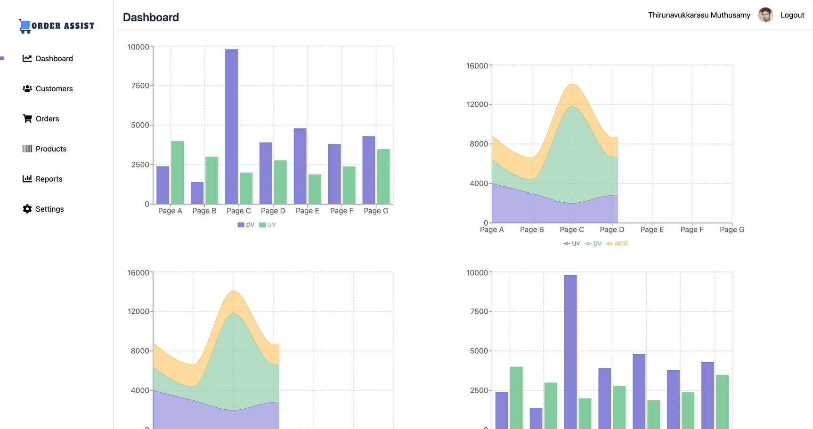

# Order Assist
A backend office admin-side dashboard and control panel for a Order Management System built using React, TailwindCSS and NodeJS.



# Features

1. Login/Logout
2. Dashboards
3. Data Grid Layout(Remote Search, Remote Sort, Remote Pagination)
4. Details Page Layout 
5. Reports(Coming Soon)
6. Settings(Coming Soon)
    * Add Users
    * Add Roles
    * Add Permissions
    * Add Groups

# Technologies

* ReactJS(CRA)
* TailwindCSS
* NodeJS/ExpresJS
* MongoDB/Mongoose
* Turborepo
* Auth0

# Local Setup

To develop all apps and packages, run the following command:
```
cd order-assist-app
npm install
npm run dev
```

# Frontend Env

```
REACT_APP_NODE_ENV=REACT_APP_NODE_ENV
REACT_APP_AUTH0_DOMAIN=REACT_APP_AUTH0_DOMAIN
REACT_APP_AUTH0_CLIENT_ID=REACT_APP_AUTH0_CLIENT_ID
```

# Backend Env

```
NODE_ENV=NODE_ENV
PORT=PORT
MONGO_DB_URI=MONGO_DB_URI
```